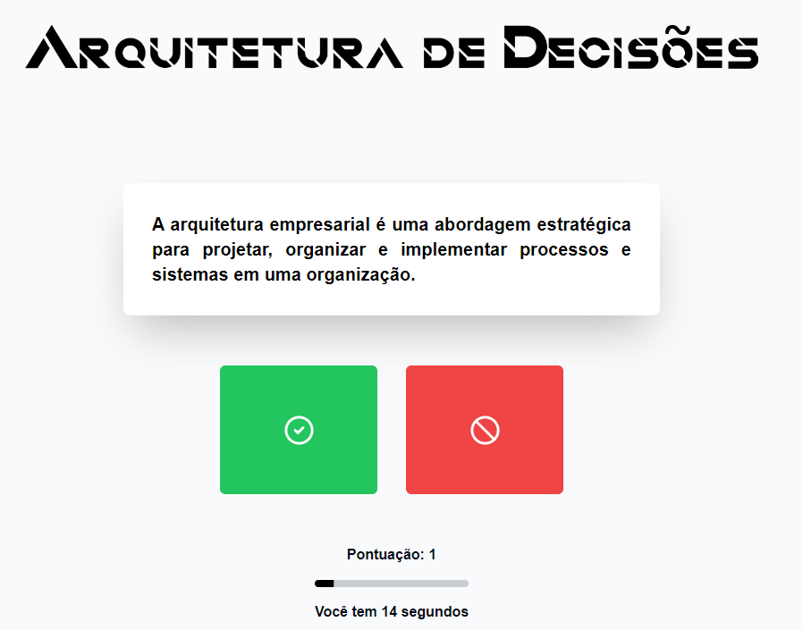

# True or False Game about Enterprise Architecture

This project consists of an educational game developed as part of an academic work on enterprise architectures. The goal is to provide an interactive and fun way to learn about the fundamental concepts of enterprise architectures.

The game is implemented using the following technologies:

- **React**: A JavaScript library for building user interfaces.
- **TypeScript**: A programming language that adds static typing to JavaScript.
- **Tailwind CSS**: A low-level utility CSS framework for creating custom designs.

## How to play

The game consists of a series of multiple-choice questions about enterprise architectures. Each question presents a statement that the player must judge as true or false.

Upon starting the game, the player is presented with a question. They can choose between the “True” or “False” options.

The player accumulates points by answering questions correctly. The score is displayed on the screen to track progress.

The game continues until all questions have been answered. At the end, the player receives a completion message with their final score.
